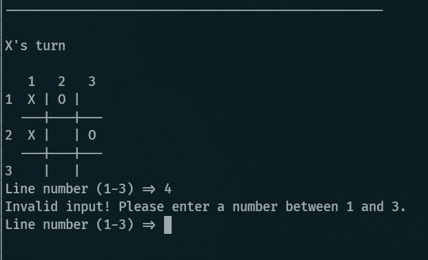

# 🖳 Console Tic Tac Toe
This project I did with C#, I'm learning about it
<br>

---



## Installation and Use

#### Requirements

- .Net sdk
- Git
---
1. Clone este repositório:
   ```bash
   git clone https://github.com/jhenriquem/console-tic-tac-toe.git 
   ```
2. Navegue até o diretório do projeto

    ```bash 
    cd console-tic-tac-toe
    ```

3. Run 
    ```bash
    dotnet run
    ```
